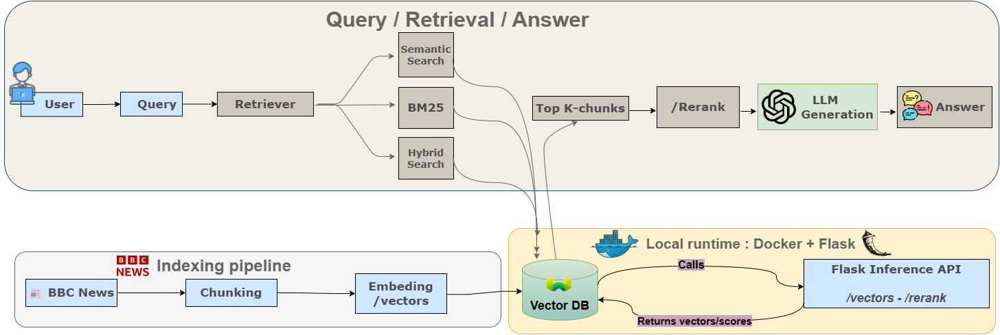
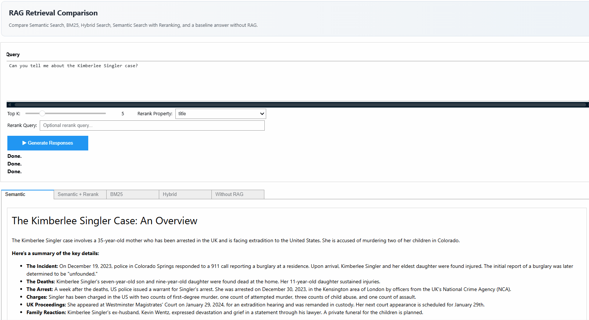

<h1 align="center">📰 RAG Pipeline: Retrieval-Augmented QA on BBC News</h1>

<p align="center">
  
  
  
</p>


<p align="center">
  <a href="./src/assets/rag_pipeline.png">
    
  </a>
</p>

## 🔍 Overview

Large Language Models can generate impressive responses, but they remain constrained by static training knowledge and limited context windows. When too much information is packed into a prompt, relevance drops, costs increase, and important details can be missed.

This repository showcases a **RAG pipeline built on BBC News data**, designed to retrieve, rerank, and inject only the most relevant context into the generation step. By combining **Weaviate vector search**, context building, and LLM-based answer generation, the system produces more grounded, scalable, and context-efficient responses.

<p align="center">
  
</p>

## 📦 Installation

This project uses **Poetry** for dependency management and environment isolation.

```bash
poetry --version
poetry init
poetry config virtualenvs.in-project true
poetry install --no-root
poetry env use python
poetry add --group dev jupyter ipykernel
poetry run python -m ipykernel install --user --name sysrag --display-name "Python (sysrag)"
```
## 📝 Instructions

```bash
poetry run python flask_app.py
docker compose up -d
```

## 🛣️ Roadmap

- [x] Build an end-to-end RAG pipeline on BBC News data
- [x] Integrate Weaviate-based vector retrieval
- [x] Add reranking for better context selection
- [x] Expose RAG pipeline endpoints through Flask
- [x] Containerize the runtime with Docker Compose
- [ ] Expose the RAG system through a user interface